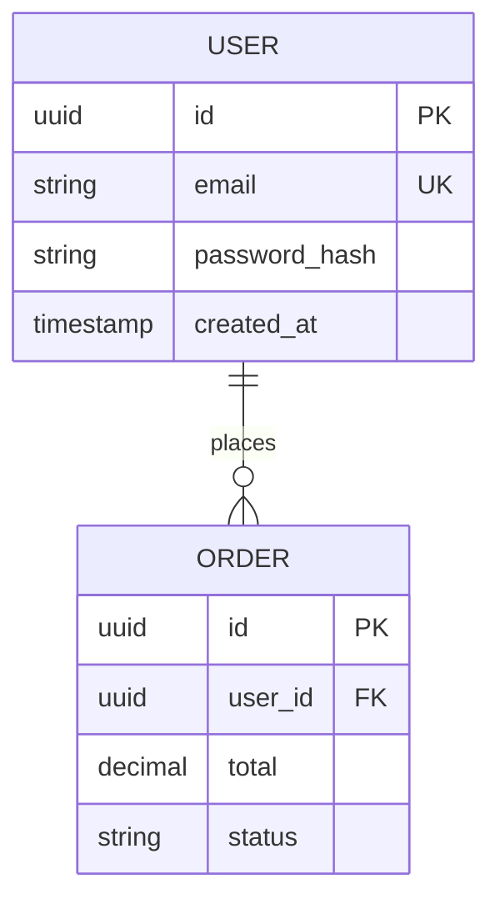
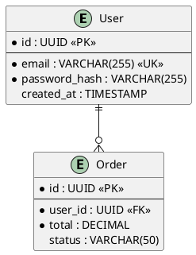

# Generate ER Diagrams

Generate Entity-Relationship diagrams from database schema documentation.

## Steps

### 1. Load Configuration

Read `.dt-workspace` config and validate generatedPaths exists.

### 2. Select Target

If arguments provided, use them. Otherwise, use AskUserQuestion:
1. Select platform
2. Select module (or "all" for entire platform)

### 3. Select Format

If --format provided, use it. Otherwise, ask:
- **mermaid** (default) - GitHub/GitLab compatible
- **plantuml** - PlantUML syntax
- **ascii** - Text-based diagram

### 4. Read Database Schemas

For each selected module:
1. Read `database-schema.md`
2. Extract table definitions, columns, relationships

### 5. Generate Diagram

**Mermaid Format**:


**PlantUML Format**:


**ASCII Format**:
```
+----------------+       +----------------+
|     USER       |       |     ORDER      |
+----------------+       +----------------+
| id (PK)        |<----->| id (PK)        |
| email (UK)     |       | user_id (FK)   |
| password_hash  |       | total          |
| created_at     |       | status         |
+----------------+       +----------------+
```

### 6. Write Output

Create diagram file:
- `<module>/er-diagram.md` (contains diagram code block)
- Or append to existing `database-schema.md`

### 7. Display Summary

```
ER DIAGRAM GENERATED

Format: <format>
Module: <module>
Output: <path>/er-diagram.md

Tables: X
Relationships: Y

To view:
- Mermaid: Render in GitHub/GitLab or mermaid.live
- PlantUML: Use plantuml.com or IDE plugin
- ASCII: View directly in any text editor
```

## Diagram Conversion

To convert between formats, specify source and target:

```
/dt-workspace:diagram --convert --from mermaid --to plantuml
```

Reads existing diagram and converts to new format.
